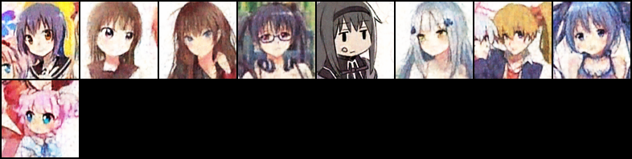
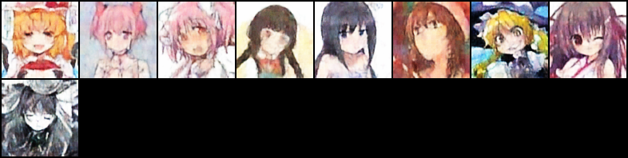

# Generative Models

## Introduction

This Repository contains some PyTorch implementations of generator models, currently i have made implementations of Basic Convolutional AutoEncoder and Variational AutoEncoder.

## Anime Faces Dataset

I have obtained the Dataset from this Repository [animeGAN](https://github.com/jayleicn/animeGAN) specifically this [link](https://drive.google.com/file/d/0B4wZXrs0DHMHMEl1ODVpMjRTWEk/view?usp=sharing) which is made available by the owner of the aforementioned Repository.

## Results

### Convolutional AutoEncoder

Trained using MSE as Reconstruction Loss. I have trained on a subset of the dataset, due to a lot of variation in the dataset.

edit: the current [notebook](conv_encoders.ipynb) contains a mixture of BCE and MSE loss.

### Variational AutoEncoder

I have tried training the VAE with a mixture of settings, NOTE: the amount of tests i have carried out are not exhaustive and i have trained the network to gain more insight into the VAE.

Trained using MSE loss as Reconstruction loss and KLDivergence loss as latent Loss

with beta=0.7 to sway model towards reconstruction.

on Unseen samples

on trained sample

Trained using BCE loss as Reconstruction loss
with beta=3 to have model generalize better

on Unseen samples

on trained sample

### Inference

+ Z must be increased(variable nz in vae network architecture) according to the image and is a best to be around the image dimension range.

+ Binary cross entropy turned out to be a slightly better reconstruction value as compared to MSE loss.

+ Weighing Beta of KLDivergence helps in managing between reconstruction vs generalization

+ As you can see in the above images, when you compare the output of the test images it is clear that the images generated with Beta as 3 is better at generalizing and creating better representations of the image.

### Things To Do 

* GAN

